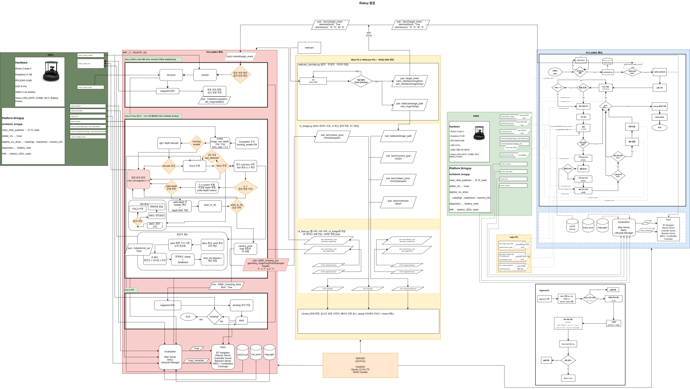

# 방공 로키
군 내의 방공 진지 저궤도 적군기 탐지 및 대응 시스템 프로젝트 

> 프로젝트 기간 : 2026. 03. 06 ~ 2026. 03. 16

Turtlebot4 두 대를 활용하여 군 방공 진지에서 저궤도 적군기를 탐지하고 대응을 수행하는 자율 로봇 시스템입니다. SLAM 기반 자율주행, Computer Vision 기반 객체 탐지, ROS2 통신, IoT 센서 및 Firebase를 통한 실시간 모니터링을 포함합니다.


  


---

## System Overview

본 시스템은 멀티 로봇 시스템으로, 각 로봇은 서로 다른 역할을 수행하며 저고도 공중 위협에 대한 탐지와 감시를 수행합니다.

##### AMR 1

- 저고도 적군기 탐지

- Computer Vision 기반 객체 탐지

- 타겟 위치 추적

##### AMR 2

- 위험 지역 이동 및 순찰

- 아두이노 센서 기반 기체 이상 감지

- 관리자에게 상태 보고 및 알림 시스템 가동

</br>

## System Architecture



## Key Features

1. **Multi-Robot System**
: 두 대의 Turtlebot4가 서로 다른 역할(적군기 탐지 및 추적 / 위험 지역 순찰)을 수행하며 협력하여 작동합니다.

2. **Computer Vision Object Detection**
: Ultralytics YOLO 모델을 이용해 카메라 영상에서 <적군기, 아군기, 풍선, 새> 탐지합니다.

3. **Autonomous Robot Navigation**
: SLAM과 Nav2를 활용하여 로봇의 자율 이동 및 순찰을 수행합니다.

4. **Real-Time Monitoring**
: Firebase Realtime Database를 이용하여 작전 경과 및 로봇 상태를 실시간으로 수집하고 모니터링합니다.

5. **Web Dashboard**
: 웹 UI를 통해 로봇 상태 및 이벤트를 확인할 수 있습니다.

 </br>

## Hardware configuration
| Component       | Description                           |
| --------------- | ------------------------------------- |
| Turtlebot4      | Mobile robot platform                 |
| Base platform   | iRobot® Create® 3                     |
| Raspberry Pi 4  | Onboard computing                     |
| OAK-D Camera    | RGB + Depth perception                |
| RPLidar A1M8    | 2D LiDAR for SLAM                     |
| Arduino         | Sensor data acquisition               |
| Gas Sensors     | Air-quality and harmful gas detection |


## Project Directory

```
.slam_turtlebot
│
├── detection (CV Object Detection 관련 파일)
│   ├── obj_det_amr2.py
│   ├── obj_det_amr2_time_sync.py
│   ├── amr1_depth_aligned_dual.py
│   ├── amr1_observe_v2_detect.py
│
├── system_monitor (Web UI 모니터링 관련 파일)
│   ├── UI_bridge.py
│   ├── UI_flask.py
│   ├── UI.html
|   ├── UI_command.py
|   ├── webcam_classifier.py
│
├── amr_control (AMR 컨트롤 관련 파일)
│   ├── amr1_moveout_follow_waypoints.py
│   ├── amr1_tracking_aerial.py
│   ├── amr1_pullout.py
│   ├── amr2_move1.py
|   
├── amr_interfaces (ROS2 사용자 인터페이스)
│   ├── msg
|   │   ├── TargetEvent.msg
|
├── models (YOLO 학습 모델 .pt 관련 파일)
│   ├── amr1
|   │   ├── yolo11n_arm1__v2.pt
|   ├── amr2
|   │   ├── yolo26n.pt
|   |   ├── resnet18.pth
|   ├── webcam
|   │   ├── 
|
│
└── image
│
└── README.md
```


## Result? / Video? / 
.gif or mp4


## Installation

### 1. Environment
- Ubuntu 22.04
- ROS2 Humble
- Python 3.10

### 2. Create Workspace
```bash
mkdir -p ~/turtlebot4_ws/src
cd ~/turtlebot4_ws
```

### 3. Clone Required Packages
```bash
cd ~/turtlebot4_ws/src

git clone https://github.com/turtlebot/turtlebot4.git -b humble
git clone https://github.com/turtlebot/turtlebot4_simulator.git -b humble
git clone https://github.com/turtlebot/turtlebot4_desktop.git -b humble
git clone https://github.com/turtlebot/turtlebot4_tutorials.git
git clone https://github.com/robo-friends/m-explore-ros2.git
```
### 4. Clone This Repository
```bash
cd ~/turtlebot4_ws/src
git clone https://github.com/June2December/slam_turtlebot.git
```

### 5. Initialize and Update rosdep
```bash
cd ~/turtlebot4_ws

if [ ! -f /etc/ros/rosdep/sources.list.d/20-default.list ]; then
    sudo rosdep init
fi

source /opt/ros/humble/setup.bash
rosdep update
```

### 6. Installation Dependencies
```bash
cd ~/turtlebot4_ws
rosdep install --from-path src -yi --rosdistro humble
```

### 7. Install Python Dependencies
```bash
pip install ultralytics opencv-python flask firebase-admin
```

### 8. Build Project Packages
```bash
cd ~/turtlebot4_ws
source /opt/ros/humble/setup.bash
colcon build --symlink-install
source install/setup.bash
```

## Run Guide

### 1. Source Environment
```bash
source /opt/ros/humble/setup.bash
source ~/turtlebot4_ws/install/setup.bash
```

### 2. Start TurtleBot4 System

```bash
ros2 launch turtlebot4_bringup robot.launch.py
```

### 3. Start Localization
```bash
ros2 launch turtlebot4_navigation localization.launch.py \
namespace:=/robot1 \
map:=$HOME/turtlebot4_ws/src/slam_turtlebot/system_monitor/third_map.yaml
```

### 4. Start RViz
```bash
ros2 launch turtlebot4_viz view_robot.launch.py namespace:=/robot1
```
Set the initial pose in RViz using **2D Pose Estimate**.

### 5. Start Nav2
```bash
ros2 launch turtlebot4_navigation nav2.launch.py namespace:=/robot1
```

### 6. Start Detection Node (AMR1)
```bash
ros2 run detection amr1_observe_v2_detect
```

### 7. Start AMR Control
```bash
ros2 launch amr_control amr1.launch.py
```

### 8. Start Monitoring System
```bash
cd ~/turtlebot4_ws/src/slam_turtlebot/system_monitor
python3 UI_flask.py
```
Web dashboard can be accessed at:
http://localhost:5000
ID : admin / PW : 1234

